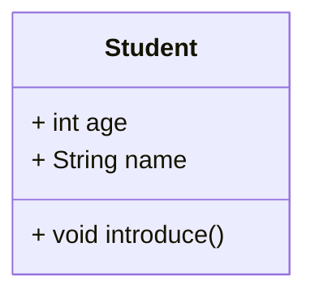
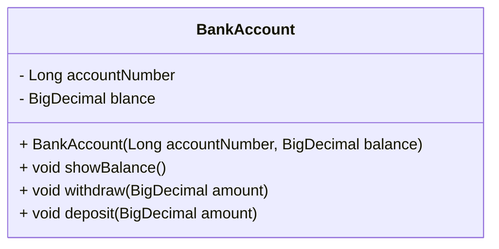
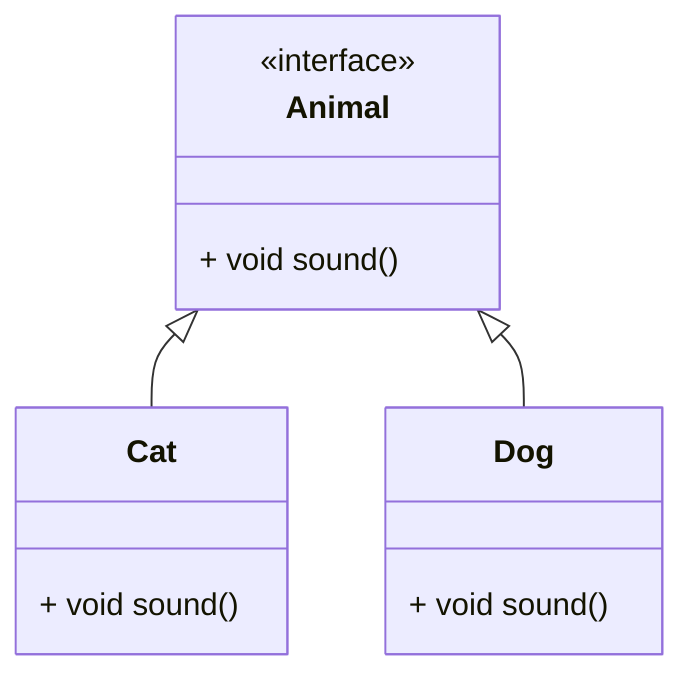

# 面向对象基础巩固

- 类与对象
- 继承/多态/封装
- 接口与抽象类
- 组合与聚合关系
- SOLID 原则（重点理解单一职责、开闭原则）放到下一篇中。

## 类和对象

### **核心概念**

- **类**：对象的蓝图，定义属性和方法（如`class Car { ... }`）

- **对象**：类的实例化实体（如`Car myCar = new Car()`）
- **成员变量** vs **局部变量**
- **构造方法**的特殊作用

UML 图：




代码示例：

```java
// 定义类
public class Student {
    // 成员变量
    private String name;
    private int age;

    // 构造方法
    public Student(String name, int age) {
        this.name = name;
        this.age = age;
    }

    // 方法
    public void introduce() {
        System.out.println("我叫" + name + ", 今年" + age + "岁");
    }
}

// 使用对象
public static void main(String[] args) {
    Student s1 = new Student("张三", 20);
    s1.introduce(); // 输出：我叫张三, 今年20岁
}
```

本实例完整代码在：  [chapter01/c01_01_01_class](../../code/chapter01/c01_01_01_class) 

### 实践练习

1. 创建一个`BankAccount`类，包含`accountNumber`、`balance`属性和`deposit()`、`withdraw()`方法。
2. 实例化两个账户并模拟转账操作。

代码实现， 完整代码放在了 `chapter01/c01_01_02_expt` 中，下面是核心代码。 

类图：




```java 
import java.math.BigDecimal;

public class BankAccount {
    // 成员变量
    private Long accountNumber;
    private BigDecimal balance;

    // 构造方法
    public BankAccount(Long accountNumber, BigDecimal balance) {
        this.accountNumber = accountNumber;
        this.balance = balance;
    }
    public void showBalance() {
        System.out.println(accountNumber + " 账户余额：" + balance);
    }
    /**
     * 存款
     */
    public void deposit(BigDecimal amount) {
        balance = balance.add(amount);
        System.out.println("存款成功，余额为：" + balance);
    }

    /**
     * 取款
     */
    public void withdraw(BigDecimal amount) {
        balance = balance.subtract(amount);
        System.out.println("取款成功，余额为：" + balance);
    }

    public static void main(String[] args) {
        BankAccount ba1 = new BankAccount(1L, new BigDecimal(1000));
        BankAccount ba2 = new BankAccount(2L, new BigDecimal(2000));
        ba1.showBalance();
        ba2.showBalance();

        ba2.withdraw(new BigDecimal(100));
        ba1.deposit(new BigDecimal(100));

        ba1.showBalance();
        ba2.showBalance();
    }
}
```

上面代码仅供参考，不作为正确答案。  完整代码在：  [chapter01/c01_01_02_expt](../../code/chapter01/c01_01_02_expt) 


## **继承与多态**

### **核心概念**

- **继承**：`extends`关键字实现代码复用（如`class Dog extends Animal`）
- **方法重写**（Override）：子类覆盖父类实现
- **多态**：父类引用指向子类对象（`Animal a = new Dog()`）
- `instanceof`运算符的使用

类图：




```java
class Animal {
    void sound() {
        System.out.println("动物发出声音");
    }
}

class Cat extends Animal {
    @Override
    void sound() {
        System.out.println("喵喵喵");
    }
}

class Dog extends Animal {
    @Override
    void sound() {
        System.out.println("汪汪汪");
    }
}

public static void main(String[] args) {
    Animal[] animals = {new Cat(), new Dog()};
    for(Animal a : animals) {
        a.sound(); // 多态表现
    }
}
```

本实例的完整代码在：  [chapter01/c01_01_03_extends](../../code/chapter01/c01_01_03_extends) 

### **实践练习**

1. 创建`Shape`父类和`Circle`、`Rectangle`子类，实现`calculateArea()`方法的多态
2. 尝试使用`super`关键字调用父类构造方法

完整代码在：  [chaper01/c01_01_04_extends_expt](../../code/chapter01/c01_01_04_extends_expt) 


## **封装**

### **核心概念**

- 访问修饰符：`private`/`protected`/`public`
- Getter/Setter方法规范
- 为什么要封装：数据保护、隐藏实现细节

```java
public class Person {
    private String name;
    private int age;

    // Getter
    public String getName() {
        return name;
    }

    // Setter
    public void setName(String name) {
        if(name == null || name.trim().isEmpty()) {
            throw new IllegalArgumentException("姓名不能为空");
        }
        this.name = name;
    }

    // 其他方法同理...
}
```

完整代码在：  [chapter01/c01_01_05_encapsulation](../../code/chapter01/c01_01_05_encapsulation) 


### **实践练习**

为之前的`BankAccount`类添加封装，确保：

- 余额不能为负数
- 账户号一旦设置不可修改

实践完整代码：  [chapter01/c01_01_06_encapsulation_expt](../../code/chapter01/c01_01_06_encapsulation_expt) 


## **接口与抽象类**

### **核心概念**

Java 的语言特性是： 单继承、多实现。只能继承一个类， 可以实现多个接口。

|          | **抽象类**         | **接口**                  |
| :------- | :----------------- | :------------------------ |
| 定义方式 | `abstract class`   | `interface`               |
| 方法实现 | 可以有具体方法     | Java 8+ 支持`default`方法 |
| 变量     | 可以有任何类型变量 | 默认`public static final` |
| 继承     | 单继承             | 多实现                    |

```java
// 抽象类
abstract class Vehicle {
    abstract void startEngine();
    
    void stopEngine() {
        System.out.println("引擎已关闭");
    }
}

// 接口
interface Flyable {
    void takeOff();
    default void land() {
        System.out.println("标准着陆流程");
    }
}

class Airplane extends Vehicle implements Flyable {
    @Override
    void startEngine() {
        System.out.println("喷气引擎启动");
    }

    @Override
    public void takeOff() {
        System.out.println("滑行后升空");
    }
}
```


### **实践练习**

1. 创建`Logger`接口和`FileLogger`、`DatabaseLogger`实现类
2. 设计一个`AbstractShape`抽象类，包含`color`属性和`abstract draw()`方法


## **组合与聚合**

### **核心概念**

- **组合（Composition）**：强所属关系（整体销毁时部分随之销毁）

```java
class Car {
    private Engine engine;  // 组合关系
    Car() {
        engine = new Engine();
    }
}
```


- **聚合（Aggregation）**：弱所属关系（整体与部分可独立存在）

```java
class Classroom {
    List<Student> students;  // 聚合关系
    void addStudent(Student s) {
        students.add(s);
    }
}
```

### **实践练习**

1. 用组合关系实现`Computer`类（包含CPU、Memory等组件）
2. 用聚合关系实现`Library`类（管理多个Book对象）