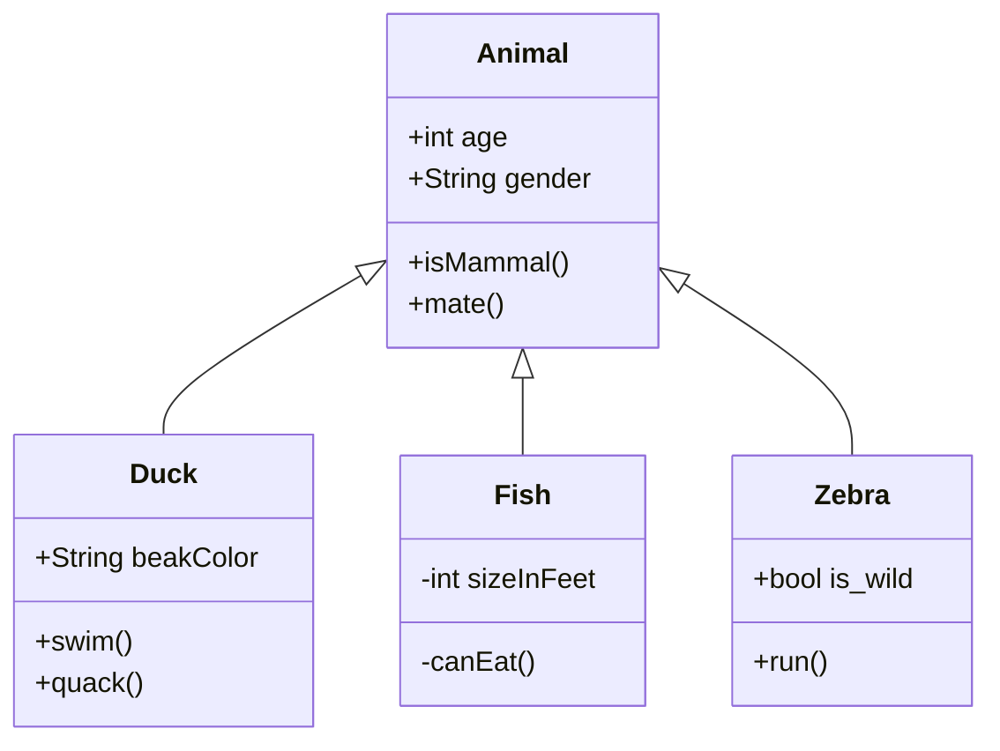

# UML 使用范例

# 类图



语法：

```
classDiagram
      Animal <|-- Duck
      Animal <|-- Fish
      Animal <|-- Zebra
      Animal : +int age
      Animal : +String gender
      Animal: +isMammal()
      Animal: +mate()
      class Duck{
          +String beakColor
          +swim()
          +quack()
      }
      class Fish{
          -int sizeInFeet
          -canEat()
      }
      class Zebra{
          +bool is_wild
          +run()
      }
```


语法解释：

| 类型   | 描述         |
| :----- | :----------- |
| `<|--` | 继承         |
| `*--`  | 组合         |
| `o--`  | 聚合         |
| `-->`  | 关联         |
| `--`   | 链接（实心） |
| `..>`  | 依赖         |
| `..|>` | 实现         |
| `..`   | 链接（虚线） |

```
<|--` 表示继承，`+` 表示 `public`，`-` 表示 `private
```

