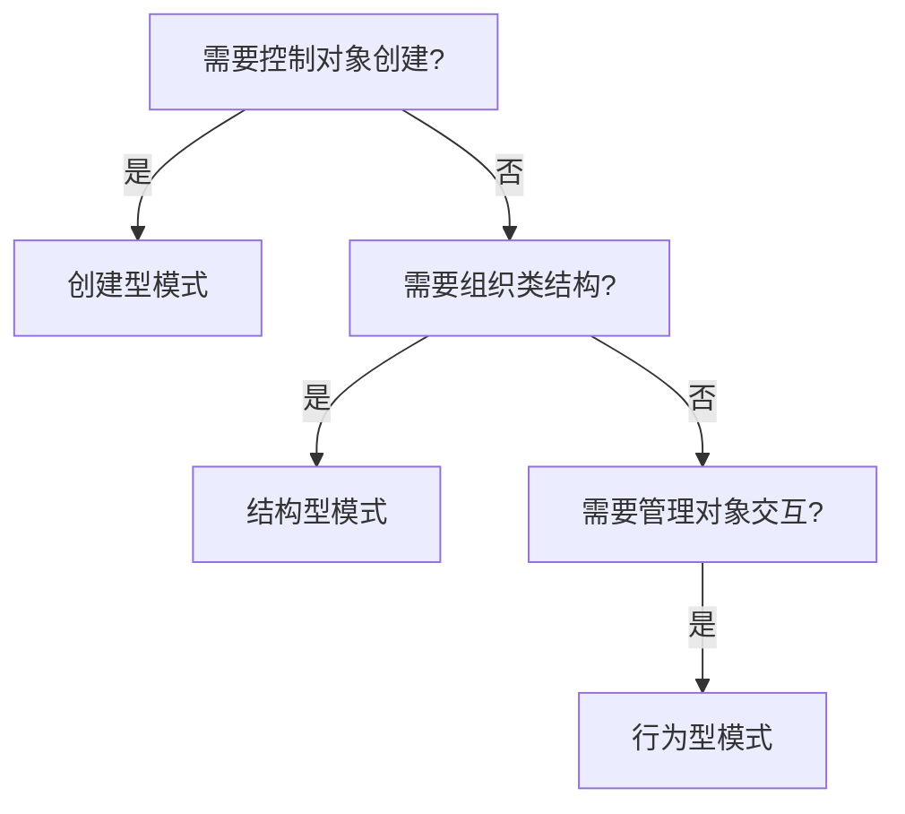

# 设计模式中的三大分类

**设计模式入门**的详细指南，包含核心概念解析、分类对比和实践方法，帮助你建立系统化的设计模式认知体系：

## **1. 设计模式的三大分类**

#### **分类概览与核心目标**

| **分类**       | **核心目标**               | **常见模式**                               | **典型应用场景**               |
| :------------- | :------------------------- | :----------------------------------------- | :----------------------------- |
| **创建型模式** | 解耦对象创建过程           | 工厂方法、抽象工厂、单例、建造者、原型     | 需要灵活控制对象实例化的场景   |
| **结构型模式** | 优化对象/类的组合方式      | 适配器、装饰器、代理、组合、享元、门面     | 处理类与对象之间复杂关系的场景 |
| **行为型模式** | 改善对象间的通信与职责分配 | 观察者、策略、模板方法、责任链、命令、状态 | 管理算法逻辑和对象协作的场景   |

#### **各分类深度解析**

**1.1 创建型模式**

```java
// 工厂方法示例
interface Logger {
    void log(String message);
}

class FileLogger implements Logger {
    @Override
    public void log(String message) {
        // 写入文件
    }
}

class LoggerFactory {
    public static Logger createLogger(String type) {
        if ("file".equals(type)) {
            return new FileLogger();
        }
        // 其他类型判断...
    }
}
```

**特点**：

- 将对象创建延迟到子类
- 符合开闭原则（新增产品类型无需修改工厂）


**1.2 结构型模式**

```java
// 适配器模式示例
class LegacyPrinter {
    void printDocument(String text) {
        System.out.println("Legacy Printing: " + text);
    }
}

interface ModernPrinter {
    void print(String content);
}

class PrinterAdapter implements ModernPrinter {
    private LegacyPrinter legacyPrinter = new LegacyPrinter();
    
    @Override
    public void print(String content) {
        legacyPrinter.printDocument(content);
    }
}
```

**特点**：

- 通过组合/继承建立对象间关系
- 解决接口不兼容问题

**1.3 行为型模式**

```java
// 观察者模式示例
interface Observer {
    void update(String message);
}

class NewsAgency {
    private List<Observer> observers = new ArrayList<>();
    
    public void addObserver(Observer o) {
        observers.add(o);
    }
    
    public void notifyObservers(String news) {
        for (Observer o : observers) {
            o.update(news);
        }
    }
}
```

**特点**：

- 关注对象间的通信机制
- 降低对象间的耦合度


### **2. 设计模式 vs 架构模式**

#### **关键差异对比**

| **维度**     | **设计模式**    | **架构模式**          |
| :----------- | :-------------- | :-------------------- |
| **作用层级** | 代码级（微观）  | 系统级（宏观）        |
| **关注点**   | 类/对象间的关系 | 组件/模块间的交互     |
| **影响范围** | 局部解决方案    | 全局结构设计          |
| **典型示例** | 观察者、装饰器  | MVC、微服务、事件驱动 |
| **变更频率** | 相对高频        | 相对低频              |

**实践案例**：

```java
// 通过依赖注入实现解耦
class OrderService {
    private PaymentProcessor processor;
    
    // 构造函数注入
    public OrderService(PaymentProcessor processor) {
        this.processor = processor;
    }
}

interface PaymentProcessor {
    void processPayment(double amount);
}

// 可轻松替换不同的支付实现
class AlipayProcessor implements PaymentProcessor {...}
class WechatPayProcessor implements PaymentProcessor {...}
```

#### **3.2 复用（Reuse）**

**实现层次**：

1. 代码级复用（继承/组合）
2. 设计级复用（模式模板）
3. 架构级复用（通用解决方案）

**反模式警示**：

```java
// 错误的重用方式：滥用继承
class ReportGenerator {
    void generatePDF() {...}
    void generateExcel() {...}
    void sendEmail() {...}  // 违反单一职责
}

// 正确的重用方式：策略模式
interface ExportStrategy {
    void export(Report report);
}

class PDFExporter implements ExportStrategy {...}
class ExcelExporter implements ExportStrategy {...}
```

#### **3.3 扩展性（Extensibility）**

**实现原则**：

- 开闭原则（OCP）
- 里氏替换原则（LSP）

**扩展性实践**：

```java
// 使用装饰器模式实现动态扩展
interface Coffee {
    double getCost();
    String getDescription();
}

class SimpleCoffee implements Coffee {...}

class MilkDecorator implements Coffee {
    private Coffee decoratedCoffee;
    
    public MilkDecorator(Coffee coffee) {
        this.decoratedCoffee = coffee;
    }
    
    @Override
    public double getCost() {
        return decoratedCoffee.getCost() + 0.5;
    }
    
    @Override
    public String getDescription() {
        return decoratedCoffee.getDescription() + ", Milk";
    }
}
```

### **4. 学习实践建议**

#### **模式识别训练**

1. **JDK源码分析**：

   - `java.util.Collections#unmodifiableList()` → 装饰器模式
   - `java.util.Observable` → 观察者模式
   - `java.lang.Runtime#getRuntime()` → 单例模式

2. **日常编码练习**：

   ```
   场景：实现可配置的缓存系统
   要求：
   1. 使用工厂方法创建不同缓存类型（内存/Redis）
   2. 用装饰器添加日志功能
   3. 通过策略模式实现缓存淘汰算法
   ```

**模式选择决策树**



### **5. 常见误区与避免方法**

1. **模式滥用**
   **错误表现**：

   ```java
   // 在简单场景强制使用模式
   class SimpleConfig {
       // 错误地使用抽象工厂
       private static AbstractConfigFactory factory;
       // ... 复杂初始化逻辑
   }
   ```

   **解决方法**：

   - 遵循 YAGNI 原则（You Ain't Gonna Need It）
   - 先实现功能，再考虑重构

2. **模式混淆**
   **典型混淆案例**：

   - 策略模式 vs 状态模式
   - 适配器模式 vs 代理模式

   **区分方法**：

   ```
   适配器模式：解决接口不兼容问题（事后补救）
   代理模式：控制对象访问（事前设计）
   ```

------

### **6. 学习进度检查表**

完成本阶段学习后，你应该能够：

- 准确区分三种模式分类
- 绘制常见模式的 UML 类图
- 在现有代码中识别至少 3 种模式的应用
- 解释 SOLID 原则与设计模式的关系
- 使用工厂方法重构简单条件判断创建逻辑

------

通过这两周的深入学习，你将建立起对设计模式的系统认知。建议结合《Head First设计模式》第三章内容进行扩展阅读，并在GitHub上创建`design-patterns-lab`仓库记录你的模式实现代码。