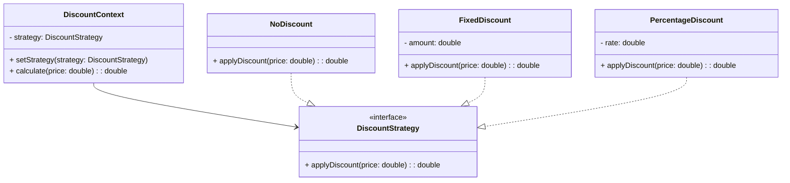

# 设计模式学习初探

### **1. 策略模式（Strategy Pattern）**

#### **1.1 模式定义**

- **核心思想**：定义算法族，将每个算法封装成独立的类，使它们可以互相替换
- **适用场景**：
  - 需要动态切换多种算法实现
  - 存在多个条件分支的相似算法
  - 需要隔离算法实现与使用代码

#### **1.2 UML 类图**



------

### **2. 简单工厂模式（Simple Factory）**

#### **2.1 模式定义**

- **核心思想**：将对象创建逻辑集中管理，客户端不直接实例化具体类
- **适用场景**：
  - 对象创建逻辑相对简单
  - 需要统一管理创建过程
  - 客户端不需要知道具体实现类

#### **2.2 工厂类结构**

```java
public class DiscountFactory {
    public static DiscountStrategy createDiscount(String type) {
        switch (type.toLowerCase()) {
            case "fixed":
                return new FixedDiscount(10); // 示例固定减10元
            case "percentage":
                return new PercentageDiscount(0.2); // 示例20%折扣
            case "nodiscount":
                return new NoDiscount();
            default:
                throw new IllegalArgumentException("未知折扣类型");
        }
    }
}
```

### **3. 完整实现代码**

#### **3.1 策略接口与实现类**


```java
// 策略接口
public interface DiscountStrategy {
    double applyDiscount(double originalPrice);
}

// 无折扣策略
public class NoDiscount implements DiscountStrategy {
    @Override
    public double applyDiscount(double originalPrice) {
        return originalPrice;
    }
}

// 固定金额折扣
public class FixedDiscount implements DiscountStrategy {
    private final double discountAmount;

    public FixedDiscount(double discountAmount) {
        this.discountAmount = discountAmount;
    }

    @Override
    public double applyDiscount(double originalPrice) {
        return Math.max(0, originalPrice - discountAmount);
    }
}

// 百分比折扣
public class PercentageDiscount implements DiscountStrategy {
    private final double discountRate; // 0~1之间

    public PercentageDiscount(double discountRate) {
        this.discountRate = Math.max(0, Math.min(1, discountRate));
    }

    @Override
    public double applyDiscount(double originalPrice) {
        return originalPrice * (1 - discountRate);
    }
}
```

#### **3.2 上下文类**

```java
public class DiscountCalculator {
    private DiscountStrategy strategy;

    public void setStrategy(DiscountStrategy strategy) {
        this.strategy = strategy;
    }

    public double calculate(double originalPrice) {
        if (strategy == null) {
            throw new IllegalStateException("未设置折扣策略");
        }
        return strategy.applyDiscount(originalPrice);
    }
}
```

#### **3.3 客户端使用示例**

```java
public class Client {
    public static void main(String[] args) {
        DiscountCalculator calculator = new DiscountCalculator();
        Scanner scanner = new Scanner(System.in);

        System.out.println("可用折扣类型：");
        System.out.println("1. 无折扣");
        System.out.println("2. 固定折扣（10元）");
        System.out.println("3. 百分比折扣（20%）");
        System.out.print("请选择折扣类型编号：");
        
        int choice = scanner.nextInt();
        DiscountStrategy strategy;
        
        switch (choice) {
            case 1:
                strategy = DiscountFactory.createDiscount("nodiscount");
                break;
            case 2:
                strategy = DiscountFactory.createDiscount("fixed");
                break;
            case 3:
                strategy = DiscountFactory.createDiscount("percentage");
                break;
            default:
                throw new IllegalArgumentException("无效选择");
        }

        calculator.setStrategy(strategy);
        System.out.print("输入商品原价：");
        double price = scanner.nextDouble();
        
        System.out.println("折后价格：" + calculator.calculate(price));
    }
}
```

------

### **4. 模式结合优势**

#### **4.1 架构优势**

- **解耦**：策略实现与使用代码分离
- **可扩展**：新增折扣类型只需添加策略类
- **可维护**：修改具体策略不影响其他代码

#### **4.2 扩展案例**

```java
// 新增满减折扣策略
public class ThresholdDiscount implements DiscountStrategy {
    private final double threshold; // 满减门槛
    private final double discount;  // 减扣金额

    public ThresholdDiscount(double threshold, double discount) {
        this.threshold = threshold;
        this.discount = discount;
    }

    @Override
    public double applyDiscount(double originalPrice) {
        return originalPrice >= threshold ? 
               originalPrice - discount : originalPrice;
    }
}

// 更新工厂类
public class DiscountFactory {
    public static DiscountStrategy createDiscount(String type) {
        // 新增类型处理
        if ("threshold".equalsIgnoreCase(type)) {
            return new ThresholdDiscount(100, 20); // 满100减20
        }
        // 原有逻辑...
    }
}
```

------

### **5. 单元测试验证**

#### **5.1 JUnit 测试用例**

```java
public class DiscountTest {
    @Test
    public void testFixedDiscount() {
        DiscountStrategy strategy = new FixedDiscount(10);
        assertEquals(90.0, strategy.applyDiscount(100.0), 0.001);
    }

    @Test
    public void testPercentageDiscount() {
        DiscountStrategy strategy = new PercentageDiscount(0.2);
        assertEquals(80.0, strategy.applyDiscount(100.0), 0.001);
    }

    @Test
    public void testThresholdDiscount() {
        DiscountStrategy strategy = new ThresholdDiscount(100, 20);
        assertEquals(80.0, strategy.applyDiscount(100.0), 0.001);
        assertEquals(90.0, strategy.applyDiscount(90.0), 0.001);
    }
}
```

### **6. 最佳实践建议**

1. **配置化扩展**：

   ```java
   // 通过配置文件加载折扣策略
   Properties props = new Properties();
   props.load(getClass().getResourceAsStream("discount.properties"));
   
   String strategyType = props.getProperty("default.strategy");
   DiscountStrategy strategy = DiscountFactory.createDiscount(strategyType);
   ```
   
2. **枚举优化**：

   ```java
   public enum DiscountType {
       NONE, FIXED, PERCENTAGE, THRESHOLD
   }
   
   // 更新工厂方法参数类型
   public static DiscountStrategy createDiscount(DiscountType type) {
       switch (type) {
           case FIXED: return new FixedDiscount(10);
           // 其他类型处理...
       }
   }
   ```
   
3. **防御式编程**：

   ```java
   public class PercentageDiscount implements DiscountStrategy {
       private final double rate;
       
       public PercentageDiscount(double rate) {
           if (rate < 0 || rate > 1) {
               throw new IllegalArgumentException("折扣率必须在0-1之间");
           }
           this.rate = rate;
       }
       // ...
   }
   ```

### **7. 常见问题解答**

**Q1：策略模式与工厂模式的区别？**

- 策略模式关注**行为**的抽象与替换
- 工厂模式关注**对象创建**的抽象与封装

**Q2：何时使用简单工厂 vs 工厂方法？**

- 简单工厂：创建逻辑简单，无需子类扩展
- 工厂方法：需要不同子类实现不同创建逻辑

**Q3：如何防止策略类过多？**

- 使用组合模式管理策略组
- 通过配置化动态加载策略
- 采用注解扫描自动注册策略

------

通过本教程，你已掌握：

1. 策略模式的实现原理
2. 简单工厂的应用场景
3. 两种模式的结合方式
4. 可扩展的折扣计算器实现

**扩展练习**：

1. 实现策略的自动注册机制
2. 添加折扣策略的优先级管理
3. 开发支持混合折扣策略（如先满减再百分比）