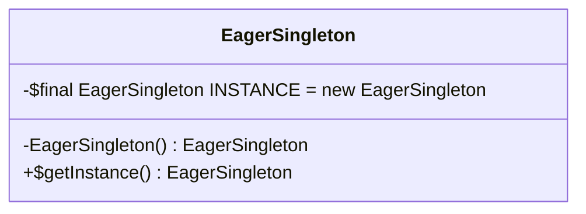

# 饿汉式单例模式

**饿汉式（Eager Initialization）**：类加载时就初始化实例，线程安全，但可能造成资源浪费。如果还没有使用到该类时， 就会导致浪费内存。

## **应用场景**

- 初始化耗时短且一定会被使用的场景（如配置管理）
- 多线程环境下的简单应用

## **优缺点**

- ✅ 线程安全，实现简单
- ❌ 类加载时即创建实例，可能浪费资源


## 代码示例

类图：



代码：

```java
public class EagerSingleton {
    // 类加载时立即初始化
    private static final EagerSingleton INSTANCE = new EagerSingleton();
    
    // 私有构造方法
    private EagerSingleton() {}
    
    public static EagerSingleton getInstance() {
        return INSTANCE;
    }
}
```

测试代码： 

```java
import com.xymiao.tutorial.design.pattern.EagerSingleton;
import org.junit.jupiter.api.Test;

public class EagerSingletonTest {
    @Test
    public void test() {
        System.out.println("EagerSingletonTest.test");
        EagerSingleton instance = EagerSingleton.getInstance();
        System.out.println("instance = " + instance);
        EagerSingleton instance2 = EagerSingleton.getInstance();
        System.out.println("instance2 = " + instance2);

        System.out.println("instance == instance2: " + (instance == instance2));
    }
}
```

运行结果如下：

```sh
EagerSingletonTest.test
instance = com.xymiao.tutorial.design.pattern.EagerSingleton@345965f2
instance2 = com.xymiao.tutorial.design.pattern.EagerSingleton@345965f2
instance == instance2: true
```


完整代码查看：  [chapter01/c02_02_01_eager](../../code/chapter02/c02_02_01_eager) 


这里也可以使用 Java 语言的特性，静态代码块的方式实现。 实现代码演示： 

```java
public class EagerCodeBlockSingleton {
    private static EagerCodeBlockSingleton INSTANCE = null;

    static {
        INSTANCE = new EagerCodeBlockSingleton();
    }
    
    private EagerCodeBlockSingleton() {
    }

    public static EagerCodeBlockSingleton getInstance() {
        return INSTANCE;
    }
}
```


### 框架中的应用

1. **Spring Framework**：虽然Spring默认使用懒加载，但可以通过配置实现饿汉式单例。.
2. **Java EE**：某些单例EJB（Enterprise JavaBeans）采用饿汉式，确保在应用启动时初始化。
3. **Apache Commons**：部分工具类使用饿汉式单例，确保全局唯一实例。
4. **Google Guice**：依赖注入框架中，单例绑定默认采用饿汉式。

饿汉式单例模式适用于资源消耗低、频繁使用且需要线程安全的场景，并在Spring、Java EE、Apache Commons和Google Guice等框架中有所应用。

