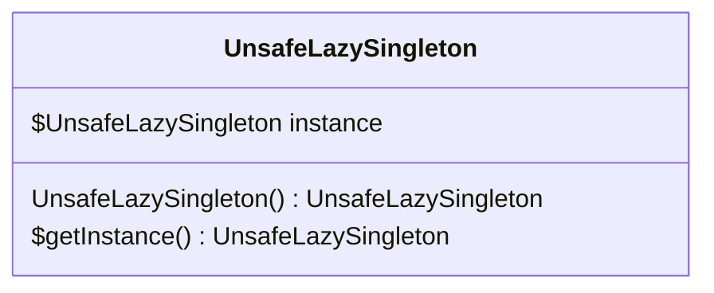
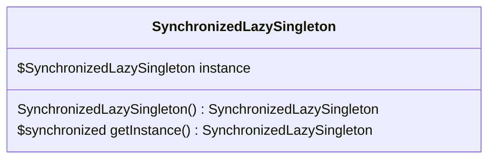

# 懒汉式单例模式

对于懒汉式的单例模式的实现， 又分为两种， 一种是线程不安全， 一种是线程安全的模式。先来说说非线程安全的方式。

## 非线程安全的方式

**懒汉式（Lazy Initialization - 非线程安全）**：懒汉式单例模式是单例模式的一种实现方式，其特点是实例在第一次被使用时才进行初始化，而不是在类加载时就创建实例。这种方式可以延迟实例的创建，节省资源。

### 应用场景

- 单线程环境下的简单应用
- 对性能要求极高的场景（无锁）

### 优缺点

- ✅ 延迟加载，节省资源。实例在第一次使用时才被创建，节省了资源。
- ❌ 线程不安全（多线程下可能创建多个实例）

### 代码示例

类图



代码

```java
public class UnsafeLazySingleton {
    private static UnsafeLazySingleton instance;
    
    private UnsafeLazySingleton() {}
    
    public static UnsafeLazySingleton getInstance() {
        if (instance == null) {
            instance = new UnsafeLazySingleton();
        }
        return instance;
    }
}
```

测试代码： 

```java
 @Test
public void test2() {
    class MyThread extends Thread {
        @Override
        public void run() {
            UnsafeLazySingleton instance = UnsafeLazySingleton.getInstance();
            System.out.println("instance = " + instance);
        }
    }
    // 10 线程同时获取 UnsafeLazySingleton 实例， 会发现有多个实例被创建。
    for (int i = 0; i < 10; i++) {
        new MyThread().start();
    }
}
```

测试效果： 

```sh
instance = com.xymiao.tutorial.design.pattern.UnsafeLazySingleton@41607ad2
instance = com.xymiao.tutorial.design.pattern.UnsafeLazySingleton@4883d4c4
instance = com.xymiao.tutorial.design.pattern.UnsafeLazySingleton@39fde0d9
instance = com.xymiao.tutorial.design.pattern.UnsafeLazySingleton@39fde0d9
instance = com.xymiao.tutorial.design.pattern.UnsafeLazySingleton@39fde0d9
instance = com.xymiao.tutorial.design.pattern.UnsafeLazySingleton@39fde0d9
instance = com.xymiao.tutorial.design.pattern.UnsafeLazySingleton@39fde0d9
instance = com.xymiao.tutorial.design.pattern.UnsafeLazySingleton@3b9b0c30
instance = com.xymiao.tutorial.design.pattern.UnsafeLazySingleton@39fde0d9
instance = com.xymiao.tutorial.design.pattern.UnsafeLazySingleton@39fde0d9
```

发现内存地址有多个: 

```sh
@41607ad2
@4883d4c4
@39fde0d9
@3b9b0c30
```


## 线程安全的方式

使用同步方法进行实现线程的安全。 

### **应用场景**

- 多线程环境但并发量不大的场景
- 对性能要求不高的简单应用

### **优缺点**

- ✅ 线程安全
- ❌ 每次获取实例都需同步，性能差


### 代码示例

类图：




代码：

```java
public class SynchronizedLazySingleton {
    private static SynchronizedLazySingleton instance;
    
    private SynchronizedLazySingleton() {}
    
    public static synchronized SynchronizedLazySingleton getInstance() {
        if (instance == null) {
            instance = new SynchronizedLazySingleton();
        }
        return instance;
    }
}
```


项目实战中， 不推荐这种方式进行编码。效率太低。

