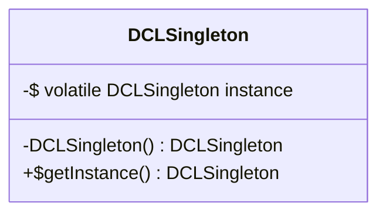

# **双重检查锁定单例模式**

**双重检查锁定（Double-Checked Locking）**：只有在第一次创建实例时才会进行同步，后续调用不会进行同步，提高了性能。

这里使用了 **volatile** 关键字， 是为了将 `instance` 声明为 `volatile`，以确保在多线程环境下的可见性。

#### **应用场景**

- 高并发环境下的延迟加载场景
- 需要高性能线程安全单例的应用

#### **优缺点**

- ✅ 延迟加载、线程安全、高性能
- ❌ 实现较复杂，需理解内存模型

## 代码示例

类图：



代码：

```java
public class DCLSingleton {
    // 必须使用 volatile 防止指令重排序, 保证 instance 的可见性, 保证线程安全
    private static volatile DCLSingleton instance;
    
    private DCLSingleton() {}
    
    public static DCLSingleton getInstance() {
        if (instance == null) {
            synchronized (DCLSingleton.class) {
                if (instance == null) {
                    instance = new DCLSingleton();
                }
            }
        }
        return instance;
    }
}
```


项目实战中， 推荐使用这种单例模式。
