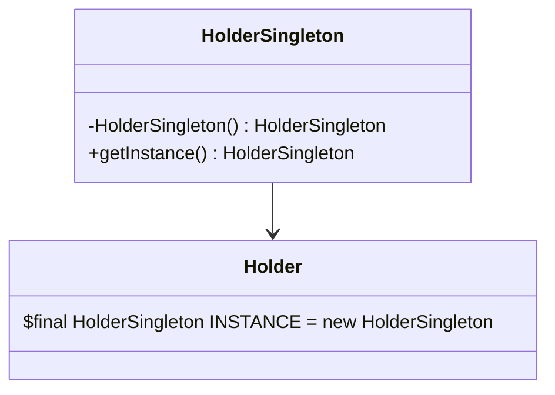

# 静态内部类实现单例模式

**静态内部类实现单例模式**（**Holder 模式**）：这种方式利用了类加载机制来保证初始化实例时只有一个线程，既实现了懒加载，又保证了线程安全。

## **应用场景**

- 需要延迟加载且线程安全的场景
- 现代Java应用推荐方式

## **优缺点**

- ✅ 线程安全、延迟加载、无同步开销
- ❌ 无法防止反射攻击

## 代码示例

类图：




代码：

```java
public class HolderSingleton {
    private HolderSingleton() {}
    
    private static class Holder {
        static final HolderSingleton INSTANCE = new HolderSingleton();
    }
    
    public static HolderSingleton getInstance() {
        return Holder.INSTANCE;
    }
}
```


项目实战中， 同样推荐这种方式进行单例模式的编码。 编写简单，还能懒加载的方式保证线程安全。


实际框架中会这样用的也挺多的， 比方说： `java.lang.Runtime`

```java
public class Runtime {
    private static final Runtime currentRuntime = new Runtime();
    public static Runtime getRuntime() {
        return currentRuntime;
    }
    /** Don't let anyone else instantiate this class */
    private Runtime() {}
	// ... 省略其他的代码
}
```

