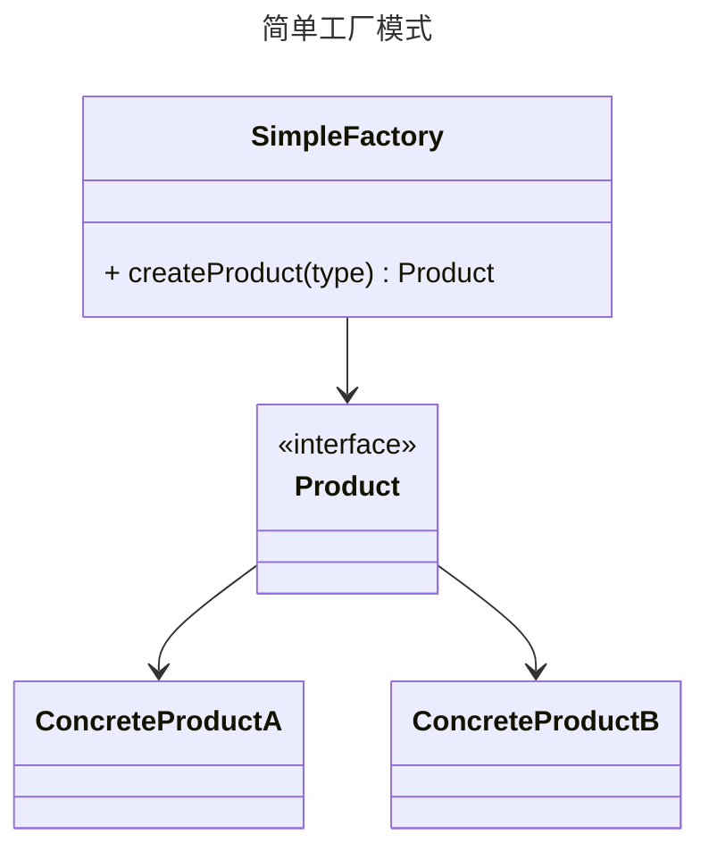

# 简单工厂模式

**简单工厂模式（Simple Factory Pattern）：**是一种创建型设计模式，它通过一个工厂类来创建对象，而不是直接在客户端代码中实例化对象。这种模式将对象的创建过程封装在一个工厂类中，使得客户端代码与具体类的实现解耦，增强了代码的可维护性和扩展性。

## 优点

1. **解耦**：客户端代码与具体产品的实现解耦，客户端只需要知道产品的接口和工厂类即可。
2. **简化代码**：将对象的创建逻辑集中在一个地方，简化了客户端代码。
3. **易于扩展**：如果需要添加新的产品类型，只需修改工厂类，而不需要修改客户端代码。

## 缺点

1. **违反开闭原则**：每次添加新的产品类型时，都需要修改工厂类的代码，违反了开闭原则（对扩展开放，对修改关闭）。
2. **工厂类职责过重**：如果产品类型很多，工厂类的代码会变得复杂，难以维护。

## 适用场景

- 当对象的创建逻辑比较简单，且不会频繁变化时。
- 当客户端不需要关心具体产品的创建过程，只需要使用产品时。

## 结构

简单工厂模式通常包含以下几个角色：

1. **工厂类（Factory）**：负责创建具体产品的实例。它通常包含一个静态方法，根据传入的参数决定创建哪种产品。
2. **抽象产品（Product）**：定义产品的接口或抽象类，所有具体产品都继承或实现这个接口。
3. **具体产品（Concrete Product）**：实现抽象产品接口的具体类，工厂类负责创建这些具体产品的实例。




## 代码示例

```java
// 抽象产品
interface Product {
    void use();
}

// 具体产品A
class ConcreteProductA implements Product {
    @Override
    public void use() {
        System.out.println("Using Product A");
    }
}

// 具体产品B
class ConcreteProductB implements Product {
    @Override
    public void use() {
        System.out.println("Using Product B");
    }
}

// 工厂类
class SimpleFactory {
    public static Product createProduct(String type) {
        if (type.equals("A")) {
            return new ConcreteProductA();
        } else if (type.equals("B")) {
            return new ConcreteProductB();
        }
        throw new IllegalArgumentException("Unknown product type");
    }
}

// 客户端代码
public class Client {
    public static void main(String[] args) {
        Product productA = SimpleFactory.createProduct("A");
        productA.use();  // 输出: Using Product A

        Product productB = SimpleFactory.createProduct("B");
        productB.use();  // 输出: Using Product B
    }
}
```


### 总结

简单工厂模式是一种简单且常用的设计模式，适用于创建对象逻辑不复杂的场景。然而，随着产品类型的增加，工厂类的代码可能会变得复杂，此时可以考虑使用工厂方法模式或抽象工厂模式来进一步解耦。