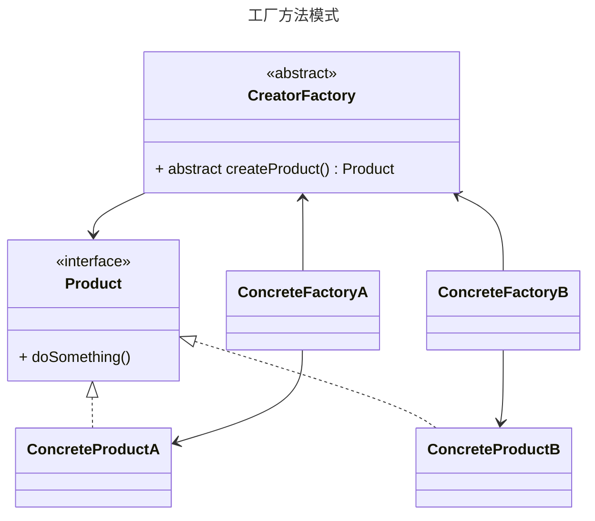

# 工厂方法模式

**工厂方法模式（Simple Factory Pattern）：**是一种创建型设计模式，将对象创建过程抽象化，定义一个创建对象的接口（抽象工厂），但由子类决定具体实例化的类。

## 优点

- **支持开闭原则**：新增产品类型时只需添加新工厂子类，无需修改已有代码
- **解耦：**客户端代码仅依赖抽象接口，不依赖具体产品类
- **扩展性**：可灵活扩展新产品系列，满足不同业务场景需求。
- **单一职责原则**：每个具体工厂只负责创建一种产品，职责清晰
- **依赖倒置原则**：高层模块不依赖低层具体实现，依赖抽象接口

## 缺点

- **类数量膨胀**：每新增一个产品类型，需新增工厂类和产品类，增加系统复杂度。

- **客户端需知具体工厂**：客户端需要明确选择具体工厂类，可能暴露实现细节。

- **简单场景冗余**： 对于固定且简单的产品创建逻辑，使用工厂方法可能显得繁琐

## 适用场景

- 当对象的创建逻辑比较简单，且不会频繁变化时。
- 当客户端不需要关心具体产品的创建过程，只需要使用产品时。

**核心角色**：

- **抽象创建者（Creator）**：声明工厂方法（`createProduct()`），返回产品类型 （`Product`），这里可以是接口也可以是抽象类。 
- **具体创建者（Concrete Creator）**：实现工厂方法，返回具体产品实例
- **产品接口（Product）**：定义产品的通用行为
- **具体产品（Concrete Product）**：实现产品接口的具体类





### **五、最佳实践建议**

1. **优先使用工厂方法替代简单工厂**

   - 当预计产品类型可能扩展时，避免条件判断导致的代码修改

2. **结合依赖注入框架**

   - 使用Spring等IoC容器管理工厂和产品对象，降低耦合度

3. **合理控制工厂层级**

   - 避免过度抽象，当产品类型固定时回退到简单工厂

4. **使用泛型优化代码**

   ```java
   // 泛型工厂方法
   abstract class Factory<T> {
       abstract T create();
   }
   
   class StringFactory extends Factory<String> {
       String create() { return "Default String"; }
   }
   ```

**工厂方法模式** 是应对对象创建复杂性和扩展性需求的经典解决方案。它通过将对象创建过程抽象为独立层次，实现了：

- **灵活扩展**：新增产品类型不影响已有系统
- **代码解耦**：使用方不依赖具体实现类
- **架构清晰**：职责划分明确，符合设计原则

**适用性判断标准**：当系统中存在 **可能变化的对象创建逻辑**，且需要 **支持未来扩展** 时，优先考虑工厂方法模式。
