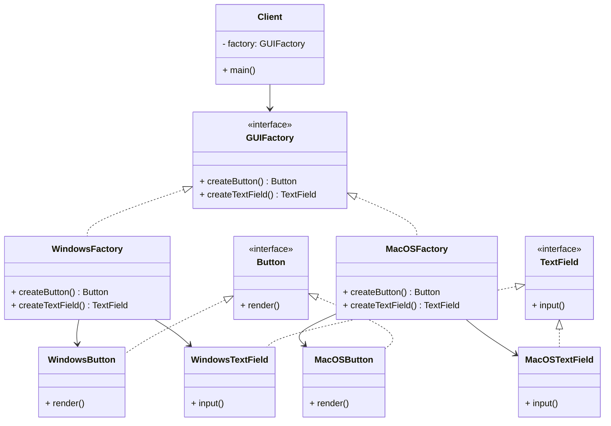
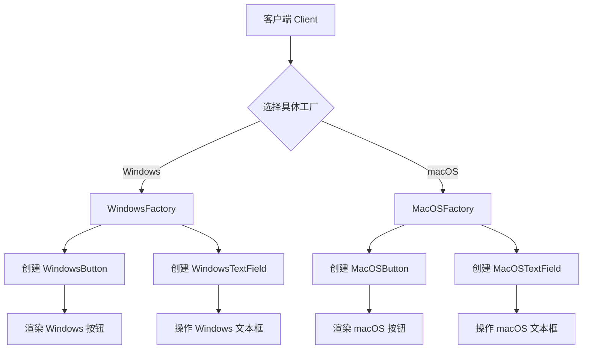
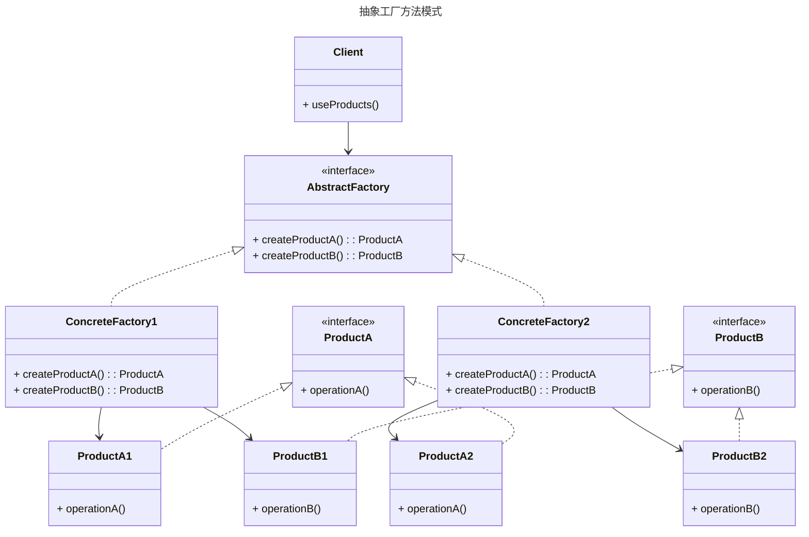

# 抽象工厂模式

##  **核心思想**

- **创建一系列相关或相互依赖的对象**（称为产品族），而无需指定它们的具体类
- **抽象工厂** 定义了创建多个产品的方法，**具体工厂** 实现这些方法生成具体产品

#### **设计原则**

- 符合 **开闭原则**（新增产品无需修改已有代码）
- 遵循 **依赖倒置原则**（高层模块依赖抽象）

#### **关键角色**

- **抽象工厂**： 声明一组创建产品的方法，每个方法对应一个产品类型。
- **具体工厂**：实现抽象工厂的方法，生成属于同一产品族的具体产品。
- **抽象产品**：定义产品的通用接口，每个产品类型对应一个抽象接口。
- **具体产品**：实现抽象产品接口的具体类，属于同一产品族的对象协同工作。

