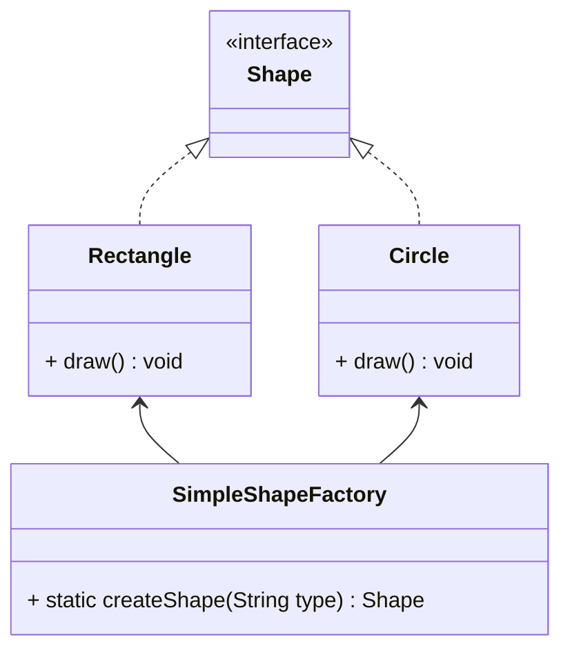
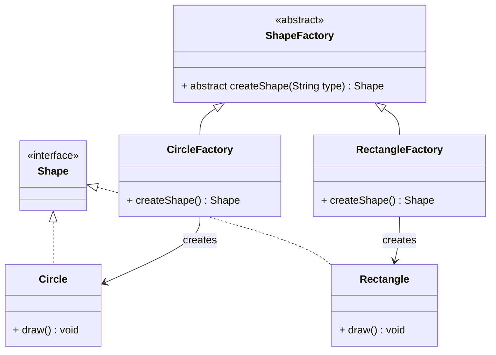
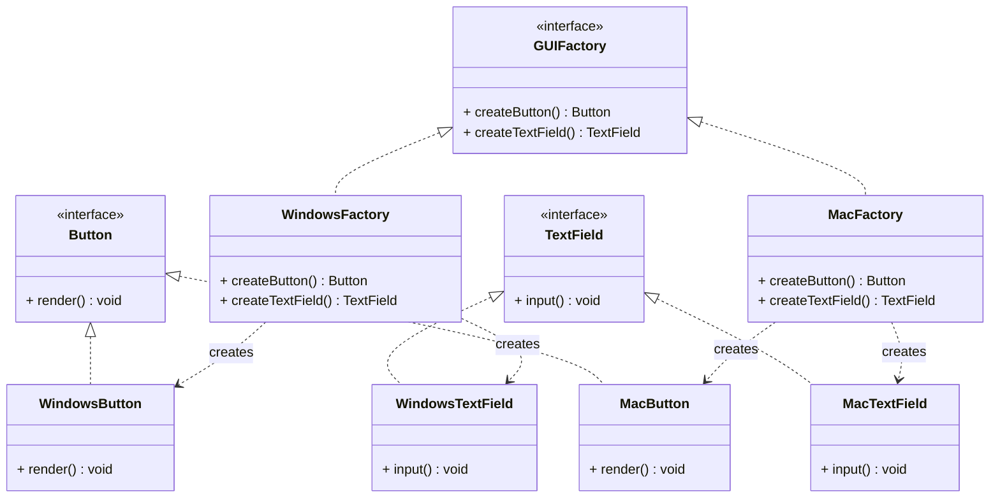
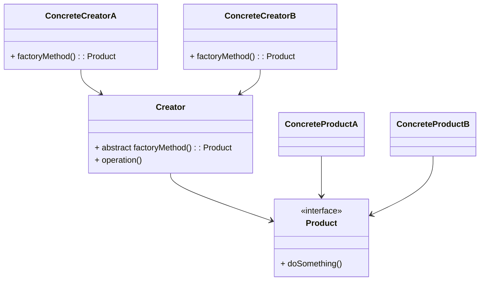

# 工厂方法模式

**工厂模式（Factory Pattern）**：工厂方法模式是一种创建型设计模式，它定义了一个创建对象的接口，但由子类决定实例化哪个类。简单来说，它将对象的创建过程延迟到子类，使得父类无需知道具体创建哪种对象。

现在用的最多的三个场景，分别是： **简单工厂方法**、**工厂方法模式** 和 **抽象工厂模式**。

## **1. 核心区别对比**

| **维度**     | **简单工厂**                   | **工厂方法**                             | **抽象工厂**                                     |
| :----------- | :----------------------------- | :--------------------------------------- | :----------------------------------------------- |
| **定义**     | 一个工厂类根据参数创建不同产品 | 每个产品对应一个工厂子类                 | 每个工厂类可创建多个相关产品组成的系列（产品族） |
| **扩展性**   | 需修改工厂类（违反开闭原则）   | 新增产品需添加新工厂子类（符合开闭原则） | 新增产品族需添加新工厂类（符合开闭原则）         |
| **复杂度**   | 简单                           | 中等                                     | 复杂                                             |
| **产品关系** | 创建单一类型的不同产品         | 创建单一类型的不同产品                   | 创建多个相关产品的组合                           |
| **典型应用** | 小型项目、产品类型固定         | 框架设计、需要扩展性                     | 跨平台组件库、成套功能模块                       |

## 2. 代码实现对比

### 2.1 简单工厂（Simple Factory）

类图：



代码：

```java
// 产品接口
interface Shape {
    void draw();
}

// 具体产品
class Circle implements Shape {
    public void draw() { System.out.println("绘制圆形"); }
}

class Rectangle implements Shape {
    public void draw() { System.out.println("绘制矩形"); }
}

// 简单工厂
class SimpleShapeFactory {
    public static Shape createShape(String type) {
        switch (type.toLowerCase()) {
            case "circle": return new Circle();
            case "rectangle": return new Rectangle();
            default: throw new IllegalArgumentException("未知形状类型");
        }
    }
}

// 使用
Shape circle = SimpleShapeFactory.createShape("circle");
circle.draw();
```


### **2.2 工厂方法（Factory Method）**

类图：



代码：

```java
// 抽象工厂
abstract class ShapeFactory {
    public abstract Shape createShape();
}

// 具体工厂
class CircleFactory extends ShapeFactory {
    public Shape createShape() { return new Circle(); }
}

class RectangleFactory extends ShapeFactory {
    public Shape createShape() { return new Rectangle(); }
}

// 使用
ShapeFactory factory = new CircleFactory();
Shape shape = factory.createShape();
shape.draw();
```


### **2.3 抽象工厂（Abstract Factory）**

类图：




代码：

```java
// 抽象产品族
interface Button { void render(); }
interface TextField { void input(); }

// 具体产品（Windows系列）
class WindowsButton implements Button {
    public void render() { System.out.println("Windows风格按钮"); }
}
class WindowsTextField implements TextField {
    public void input() { System.out.println("Windows输入框"); }
}

// 具体产品（macOS系列）
class MacOSButton implements Button {
    public void render() { System.out.println("macOS风格按钮"); }
}
class MacOSTextField implements TextField {
    public void input() { System.out.println("macOS输入框"); }
}

// 抽象工厂
interface GUIFactory {
    Button createButton();
    TextField createTextField();
}

// 具体工厂
class WindowsFactory implements GUIFactory {
    public Button createButton() { return new WindowsButton(); }
    public TextField createTextField() { return new WindowsTextField(); }
}

class MacOSFactory implements GUIFactory {
    public Button createButton() { return new MacOSButton(); }
    public TextField createTextField() { return new MacOSTextField(); }
}

// 使用
GUIFactory factory = new WindowsFactory();
Button btn = factory.createButton();
TextField tf = factory.createTextField();
btn.render();
tf.input();
```


## 3. 应用场景对比

### 3.1 简单工厂适用场景

- 产品类型较少且不频繁变化
- 不需要高度扩展性的小型项目
- 快速原型开发

### 3.2 工厂方法适用场景

- 需要灵活扩展产品类型
- 框架设计（如日志系统、支付网关）
- 希望遵循开闭原则的项目

### 3.3 抽象工厂适用场景

- 需要创建成套关联对象
- 跨平台UI组件库开发
- 数据库访问层（支持多数据库类型）

## 4. 如何选择？

| **选择条件**                   | **推荐模式**        |
| :----------------------------- | :------------------ |
| 产品类型固定且简单             | 简单工厂            |
| 需要灵活扩展单个产品类型       | 工厂方法            |
| 需要创建多个关联产品组成的系列 | 抽象工厂            |
| 框架设计/第三方库开发          | 工厂方法 + 抽象工厂 |
| 需要严格遵循开闭原则           | 工厂方法/抽象工厂   |

## **5. 综合对比总结**

| **特征**             | **简单工厂** | **工厂方法**   | **抽象工厂**           |
| :------------------- | :----------- | :------------- | :--------------------- |
| **产品维度**         | 单一产品     | 单一产品       | 多个关联产品（产品族） |
| **扩展方式**         | 修改工厂类   | 添加新工厂子类 | 添加新工厂类           |
| **代码复杂度**       | 低           | 中             | 高                     |
| **开闭原则支持**     | 违反         | 支持           | 支持                   |
| **典型设计原则体现** | -            | 依赖倒置       | 接口隔离               |
| **适合项目规模**     | 小型         | 中型           | 大型                   |

------

通过理解这三种工厂模式的差异，您可以根据实际需求选择最合适的对象创建方式。建议在项目初期优先使用简单工厂，随着复杂度增加逐步升级到工厂方法或抽象工厂。


类图




## 代码示例

```java
// 1. 定义产品接口
interface Transport {
    void deliver();
}

// 2. 具体产品实现
class Truck implements Transport {
    @Override
    public void deliver() {
        System.out.println("陆路运输：卡车送货");
    }
}

class Ship implements Transport {
    @Override
    public void deliver() {
        System.out.println("海运：货轮运输");
    }
}

// 3. 抽象创建者
abstract class Logistics {
    // 工厂方法
    public abstract Transport createTransport();
    
    // 业务逻辑
    public void planDelivery() {
        Transport transport = createTransport();
        transport.deliver();
    }
}

// 4. 具体创建者
class RoadLogistics extends Logistics {
    @Override
    public Transport createTransport() {
        return new Truck();
    }
}

class SeaLogistics extends Logistics {
    @Override
    public Transport createTransport() {
        return new Ship();
    }
}
```

测试使用：

```java
public class Client {
    public static void main(String[] args) {
        Logistics logistics = new RoadLogistics();
        logistics.planDelivery(); // 输出：陆路运输：卡车送货
        
        logistics = new SeaLogistics();
        logistics.planDelivery(); // 输出：海运：货轮运输
    }
}
```


### **最佳实践**

1. **命名规范**

   - 工厂方法通常命名为`createXxx()`
   - 具体工厂类以`XxxFactory`结尾

**代码优化技巧**

```java
// 使用泛型减少重复代码
abstract class Logistics<T extends Transport> {
    public abstract T createTransport();
}

class RoadLogistics extends Logistics<Truck> {
    public Truck createTransport() {
        return new Truck();
    }
}
```

**结合依赖注入**

```java
// 通过构造函数注入工厂
class OrderService {
    private final PaymentProcessor processor;
    
    public OrderService(PaymentProcessor processor) {
        this.processor = processor;
    }
    
    public void processOrder(double amount) {
        processor.handlePayment(amount);
    }
}
```


### **常见问题解答**

**Q1：如何处理产品初始化参数？**
通过工厂方法传递参数：

```java
abstract class Logistics {
    public abstract Transport createTransport(int capacity);
}

class TruckLogistics extends Logistics {
    public Transport createTransport(int capacity) {
        return new Truck(capacity);
    }
}
```


**Q2：何时使用工厂方法模式？**

- 当创建逻辑可能变化或需要扩展时
- 当需要将产品创建与使用解耦时

**Q3：如何防止工厂类爆炸（子类过多）？**

- 使用参数化工厂方法
- 结合反射机制动态创建产品
- 采用注解扫描自动注册工厂

**Q4：工厂方法模式如何支持开闭原则？**

- 新增产品只需添加新的具体工厂类
- 无需修改现有代码

**Q5：工厂方法模式如何支持测试？**

- 通过 Mock 工厂注入测试替身
- 实现内存数据库等测试专用工厂

### **实际应用案例**

#### **JDK中的工厂方法**

- `java.util.Collections#unmodifiableList()`
- `java.util.Calendar#getInstance()`
- `java.util.Collections#unmodifiableList()`
- `java.nio.charset.Charset#forName()`
- `java.net.URLStreamHandlerFactory`

#### **Spring框架中的应用**

- `BeanFactory`接口
- `ApplicationContext`的具体实现类（如 `ClassPathXmlApplicationContext`）


### **总结**

**工厂方法模式的核心价值**：

- 将对象创建与使用解耦
- 提高系统的扩展性和维护性
- 支持符合开闭原则的代码演进

**适用场景**：

- 需要灵活创建对象的场景
- 产品类型可能频繁扩展的系统
- 框架需要为不同环境提供不同实现

通过合理应用工厂方法模式，可以显著提升代码的可维护性和扩展性。建议结合具体业务场景灵活选择实现方式，并注意避免过度设计。